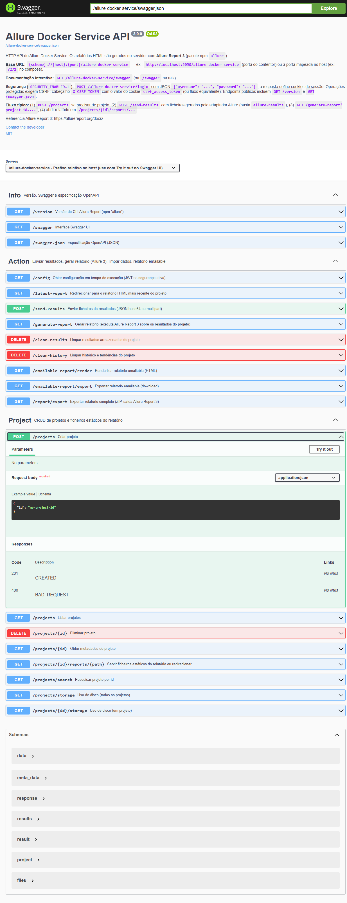
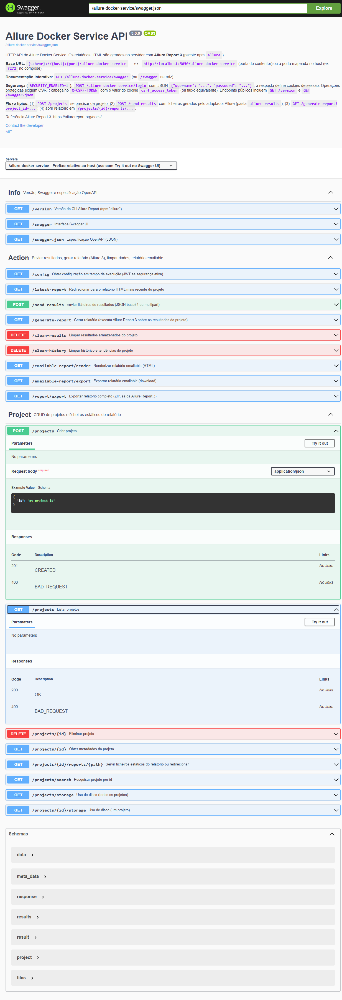
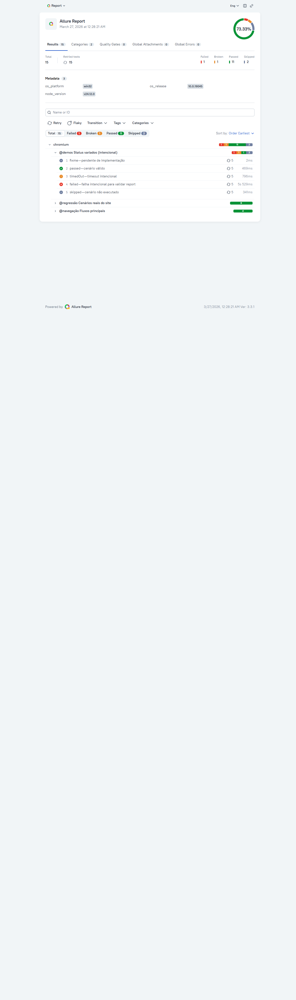
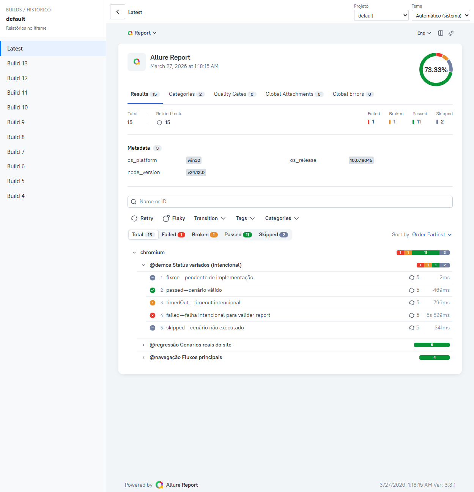
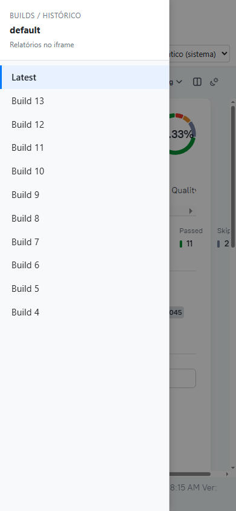
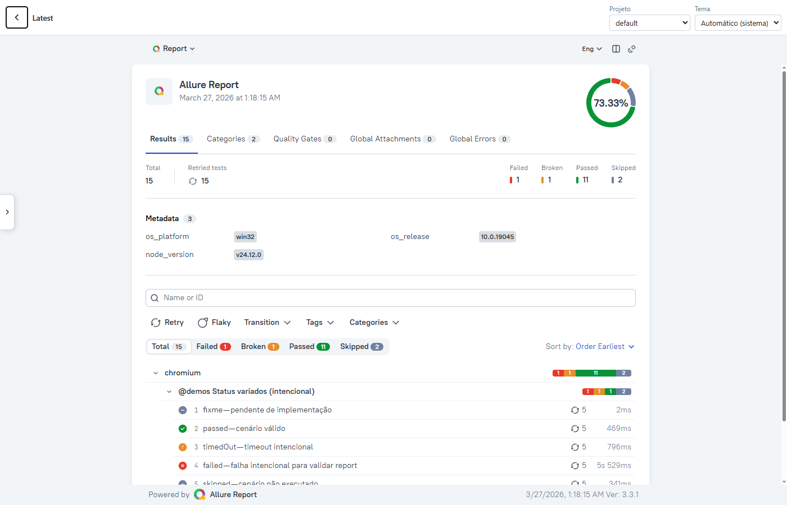
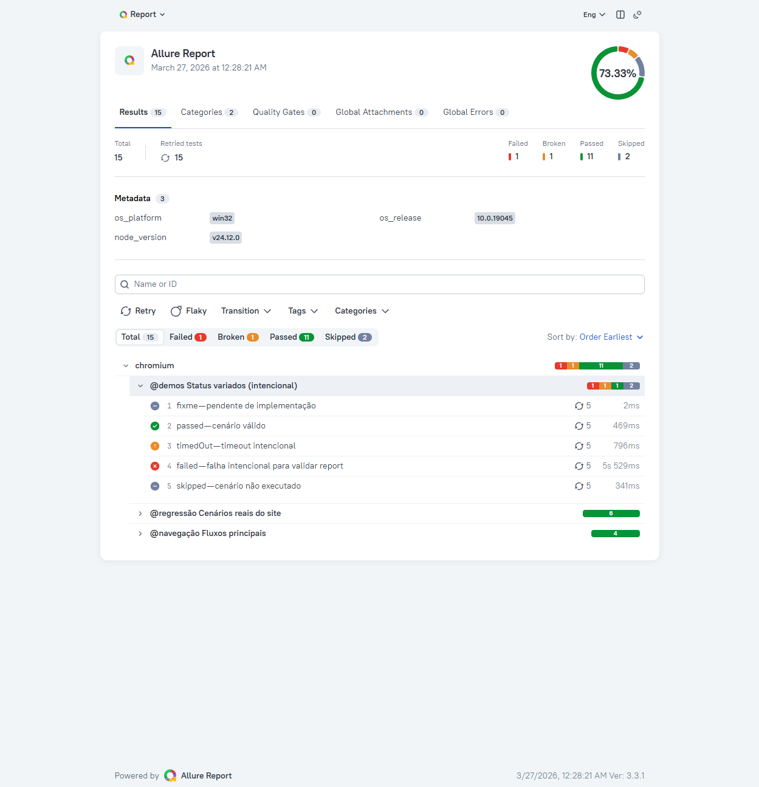
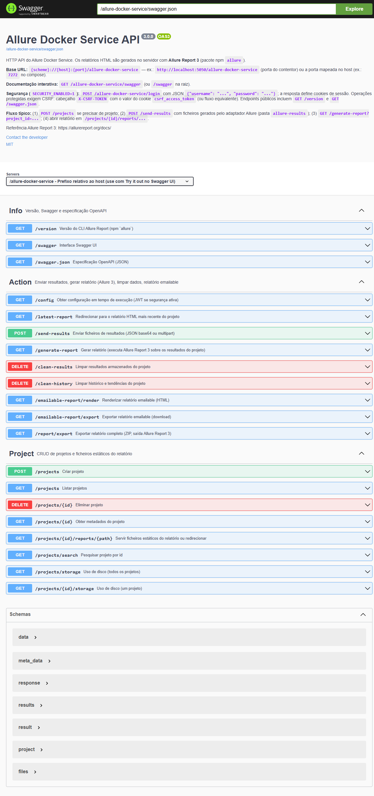
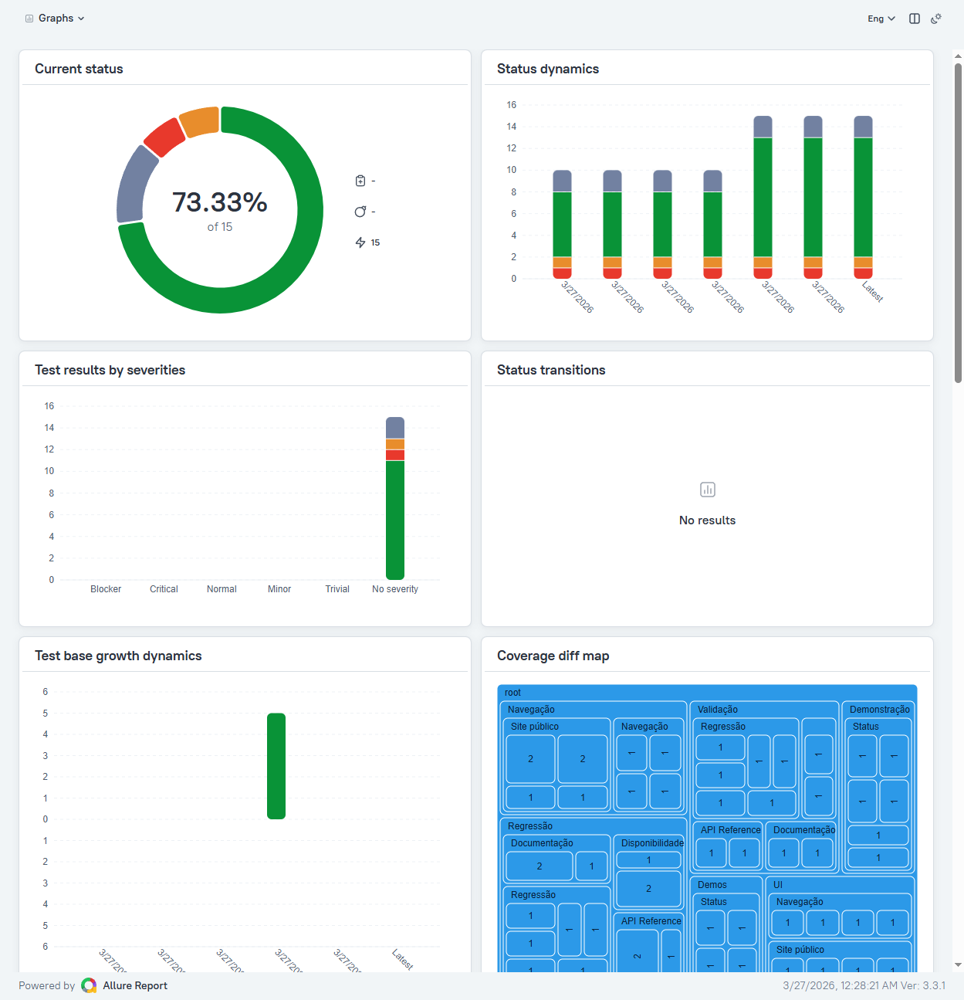
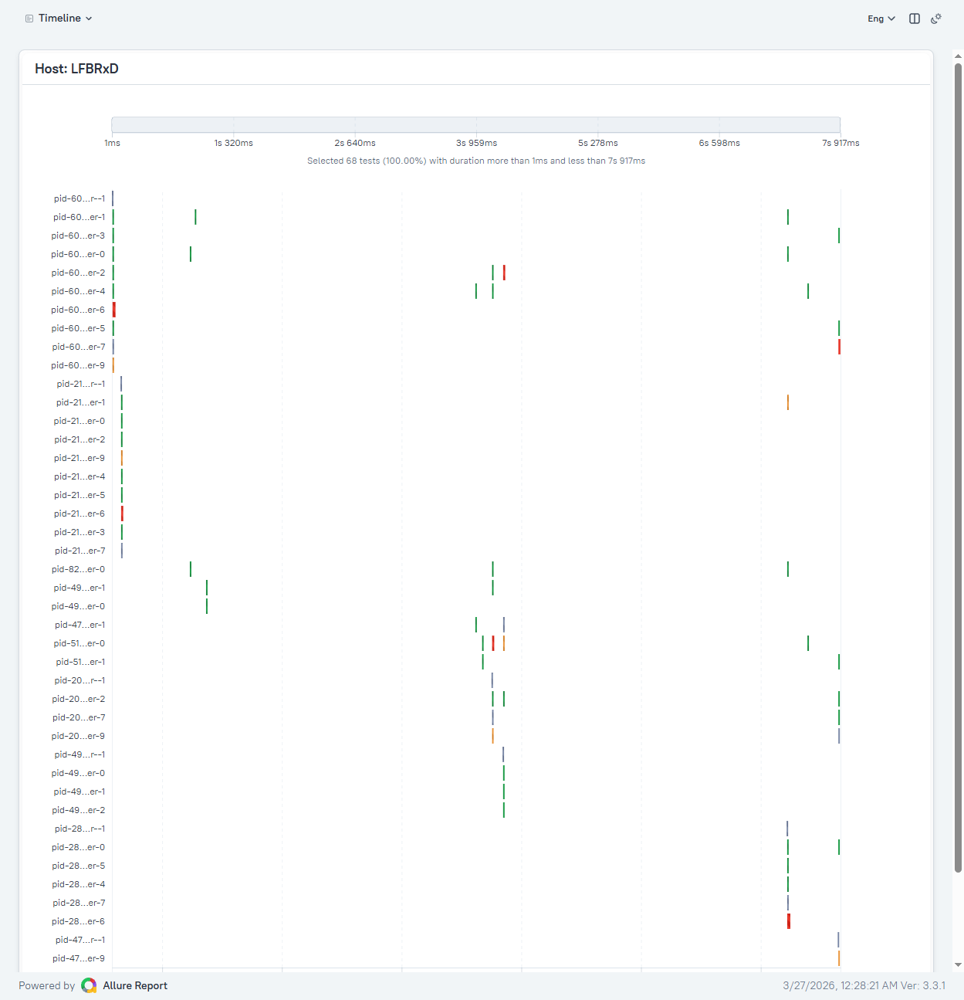

[Allure Report](https://allurereport.org/) · [Docker](https://docs.docker.com/)

# ALLURE DOCKER SERVICE

[](https://github.com/LFBRxD/allure-docker-service/actions)

> This fork targets **Allure Report 3** (npm package `allure`). **Screenshots committed in-repo** live under [`docs/images/`](docs/images/) — add or replace them when you refresh the docs.
>
> **Mantenedor deste fork:** [Flavio Ramos](https://github.com/LFBRxD) — **Projeto original:** [Frank Escobar](https://github.com/fescobar) ([Allure Docker Service](https://github.com/fescobar/allure-docker-service)).
>
> **Imagem Docker Hub (Allure 3, uso público):** [hub.docker.com/r/flaviordesouza/allure-docker-service](https://hub.docker.com/r/flaviordesouza/allure-docker-service)


Table of contents
=================
   * [ACKNOWLEDGEMENTS](#acknowledgements)
   * [FEATURES](#FEATURES)
      * [Docker Hub](#docker-hub)
      * [Docker Versions](#docker-versions)
   * [USAGE](#USAGE)
      * [Generate Allure Results](#generate-allure-results)
      * [ALLURE DOCKER SERVICE](#allure-docker-service-1)
          * [SINGLE PROJECT - LOCAL REPORTS](#SINGLE-PROJECT---LOCAL-REPORTS)
            * [Single Project - Docker on Unix/Mac](#single-project---docker-on-unixmac)
            * [Single Project - Docker on Windows (Git Bash)](#single-project---docker-on-windows-git-bash)
            * [Single Project - Docker Compose](#single-project---docker-compose)
          * [MULTIPLE PROJECTS - REMOTE REPORTS](#MULTIPLE-PROJECTS---REMOTE-REPORTS)
            * [Multiple Project - Docker on Unix/Mac](#multiple-project---docker-on-unixmac)
            * [Multiple Project - Docker on Windows (Git Bash)](#multiple-project---docker-on-windows-git-bash)
            * [Multiple Project - Docker Compose](#multiple-project---docker-compose)
            * [Creating our first project](#creating-our-first-project)
      * [PORT 4040 Deprecated](#port-4040-deprecated)
      * [Known Issues](#known-issues)
      * [Opening & Refreshing Report](#opening--refreshing-report)
         * [Report navigator](#report-navigator)
      * [New User Interface](#new-user-interface)
      * [Deploy using Kubernetes](#deploy-using-kubernetes)
      * [Extra options](#extra-options)
          * [Allure API](#allure-api)
            * [Info Endpoints](#info-endpoints)
            * [Action Endpoints](#action-endpoints)
            * [Project Endpoints](#project-endpoints)
          * [Send results through API](#send-results-through-api)
            * [Content-Type - application/json](#content-type---applicationjson)
            * [Content-Type - multipart/form-data](#content-type---multipartform-data)
            * [Force Project Creation Option](#force-project-creation-option)
          * [Customize Executors Configuration](#customize-executors-configuration)
          * [API Response Less Verbose](#api-response-less-verbose)
          * [Switching version](#switching-version)
          * [Switching port](#switching-port)
          * [Updating seconds to check Allure Results](#updating-seconds-to-check-allure-results)
          * [Keep History and Trends](#keep-history-and-trends)
          * [Override User Container](#override-user-container)
          * [Start in DEV Mode](#start-in-dev-mode)
          * [Enable TLS](#enable-tls)
          * [Enable Security](#enable-security)
            * [Login](#login)
            * [X-CSRF-TOKEN](#x-csrf-token)
            * [Refresh Access Token](#refresh-access-token)
            * [Logout](#logout)
            * [Roles](#roles)
            * [Make Viewer endpoints public](#make-viewer-endpoints-public)
            * [Scripts](#scripts)
          * [Multi-instance Setup](#multi-instance-setup)
          * [Add Custom URL Prefix](#add-custom-url-prefix)
          * [Optimize Storage](#optimize-storage)
          * [Export Native Full Report](#export-native-full-report)
          * [Customize Emailable Report](#customize-emailable-report)
              * [Override CSS](#override-css)
              * [Override title](#override-title)
              * [Override server link](#override-server-link)
              * [Develop a new template](#develop-a-new-template)
          * [Allure Customized Plugins](#allure-customized-plugins)
          * [Allure Options](#allure-options)
   * [SUPPORT](#SUPPORT)
      * [Gitter](#gitter)
   * [DOCKER GENERATION (Usage for developers)](#docker-generation-usage-for-developers)

## ACKNOWLEDGEMENTS

**Mantenedor principal (este fork):** [Flavio Ramos](https://github.com/LFBRxD) — desenvolvimento e manutenção (Allure Report 3, API, Swagger, Docker, documentação e CI).

**Autor original:** [Frank Escobar](https://github.com/fescobar) — criador do [Allure Docker Service](https://github.com/fescobar/allure-docker-service) upstream; este fork mantém o crédito e a base sobre a qual as alterações foram construídas.

## FEATURES
Allure Framework provides you good looking reports for automation testing.
For using this tool is required to install a server. You could have this server running on Jenkins or if you want to see reports locally, you need to run some commands on your machine. This work results tedious, at least for me :)

For that reason, this docker container allows you to see up to date reports simply mounting your `allure-results` directory (for a Single Project) or your `projects` directory (for Multiple Projects). Every time appears new results (generated for your tests), Allure Docker Service will detect those changes and it will generate a new report automatically (optional: send results / generate report through API), what you will see refreshing your browser.

- Useful for developers who wants to run tests locally and want to see what were the problems during regressions.
- Useful for the team to check the tests status for every project.
- **Report navigator:** one HTML page ([`GET /allure-docker-service/report-navigator`](#report-navigator)) to pick the project and open **latest** or **history** builds in iframes; switching builds **keeps the same in-report view** (hash / sub-path) when possible, plus optional static `reports/report-navigator.html` after each generation.

### Docker Hub
- **Link público da imagem (uso):** [https://hub.docker.com/r/flaviordesouza/allure-docker-service](https://hub.docker.com/r/flaviordesouza/allure-docker-service) — **Allure Report 3** (npm `allure`), alinhado com este README.
- **Imagem Docker Hub de Frank Escobar:** [frankescobar/allure-docker-service](https://hub.docker.com/r/frankescobar/allure-docker-service) — corresponde ao fluxo **Allure Report 2** (stack antiga). **Não** é Allure 3; não a uses como substituto da imagem v3 deste fork.

**Ajustar o que aparece no Docker Hub (duas camadas):**

1. **Página do repositório** (texto para humanos) — em [hub.docker.com](https://hub.docker.com/) → teu repositório → **Settings** / **General**: *Description* (curta). Em **Repositories** → **flaviordesouza/allure-docker-service** → **Edit** (ou *Manage repository*): secção **Overview** em Markdown (instalação, portas, link do GitHub). Opcional: **Linked GitHub** / **Automated builds** ou copiar manualmente trechos deste README quando publicares uma versão.
2. **Metadados dentro da imagem** (labels OCI / label-schema) — definidos no [`docker/Dockerfile`](docker/Dockerfile); preenchidos na build com `--build-arg BUILD_DATE=…`, `BUILD_VERSION=…`, `BUILD_REF=…` (o [CI](.github/workflows/docker-publish.yml) já passa estes args em release). Consulta local: `docker inspect flaviordesouza/allure-docker-service:TAG --format '{{json .Config.Labels}}' | jq`.

**Overview para colar no Docker Hub:** texto Markdown pronto em [`docs/DOCKER_HUB_OVERVIEW.md`](docs/DOCKER_HUB_OVERVIEW.md) (Repository → *Edit* → secção **Overview**).

### Docker Versions
The image bundles [Allure Report 3](https://allurereport.org/docs/) via the official npm package `allure` (build arg `ALLURE_NPM_VERSION`, default `3.3.1`).

**Dois números diferentes:** (1) **Tag da imagem no registry** — versão de **release deste fork** (definida pela tag Git `vX.Y.Z` no CI, ou `main` / `sha-…` em pushes na `main`). Não tem de coincidir com o Allure. (2) **Versão do Allure CLI** na imagem — vem de `ALLURE_NPM_VERSION`; consulta `GET /version` e a label `allure.npm.version` em `docker inspect`.

#### Image Variants
CI publishes **linux/amd64** and **linux/arm64** (no armv7: the Allure CLI layer uses official `node:22-bookworm-slim`, which does not ship armv7).

- Tags (fork): https://hub.docker.com/r/flaviordesouza/allure-docker-service/tags
- **Branch `main`:** cada push bem-sucedido publica release automática **`1.0.<N>`** (`N` = número de commits até o commit do push, via `git rev-list --count`), atualiza **`latest`** para esse build e mantém manifests **`main`** e **`sha-<8 hex>`**. Não precisas criar tag Git. Tags **`v*`** continuam opcionais para releases semver “manuais”.

The following table shows the variation of provided images.

|**Base Image**                              |**Arch** | **OS** |
|--------------------------------------------|---------|--------|
| python:3.13-slim-bookworm + Node 22 (npm `allure`) | amd64   | debian |
| python:3.13-slim-bookworm + Node 22 (npm `allure`) | arm64   | debian |

The following table shows the provided Manifest Lists.

| **Tag**                                | **allure-docker-service per-arch tags (example)** |
|----------------------------------------|---------------------------------------------------|
| latest, 1.4.0 (ex.: git tag `v1.4.0`)  | flaviordesouza/allure-docker-service:1.4.0-amd64   |
|                                        | flaviordesouza/allure-docker-service:1.4.0-arm64   |
| main, sha-abc12345                     | flaviordesouza/allure-docker-service:main-amd64, …-arm64 (and matching `sha-*-arch`) |

## USAGE
### Generate Allure Results
First at all it's important to be clear. This container only generates reports based on results. You have to generate allure results according to the technology what are you using.

Reference: https://github.com/fescobar/allure-docker-service-examples

We have some examples projects:
- [allure-docker-java-testng-example](https://github.com/fescobar/allure-docker-service-examples/tree/master/allure-docker-java-testng-example)
- [allure-docker-java-junit4-example](https://github.com/fescobar/allure-docker-service-examples/tree/master/allure-docker-java-junit4-example)
- [allure-docker-java-cucumber-jvm-example](https://github.com/fescobar/allure-docker-service-examples/tree/master/allure-docker-java-cucumber-jvm-example)
- [allure-docker-nodejs-cucumber-example](https://github.com/fescobar/allure-docker-service-examples/tree/master/allure-docker-nodejs-cucumber-example)
- [allure-docker-nodejs-typescript-cucumber-example](https://github.com/fescobar/allure-docker-service-examples/tree/master/allure-docker-nodejs-typescript-cucumber-example)
- [allure-docker-nodejs-typescript-mocha-example](https://github.com/fescobar/allure-docker-service-examples/tree/master/allure-docker-nodejs-typescript-mocha-example)
- [allure-docker-python-behave-example](https://github.com/fescobar/allure-docker-service-examples/tree/master/allure-docker-python-behave-example)
- [allure-docker-python-pytest-example](https://github.com/fescobar/allure-docker-service-examples/tree/master/allure-docker-python-pytest-example)
- [AllureDockerCSharpExample](https://github.com/fescobar/allure-docker-service-examples/tree/master/AllureDockerCSharpExample)
- [AllureDockerCSharpSpecFlow3Example](https://github.com/fescobar/allure-docker-service-examples/tree/master/AllureDockerCSharpSpecFlow3Example)

In this case we are going to generate results using the java project [allure-docker-java-testng-example](https://github.com/fescobar/allure-docker-service-examples/tree/master/allure-docker-java-testng-example) of this repository.

Go to directory [allure-docker-java-testng-example](https://github.com/fescobar/allure-docker-service-examples/tree/master/allure-docker-java-testng-example) via command line:

```sh
cd allure-docker-java-testng-example
```
Execute:

```sh
mvn test -Dtest=FirstTest
```
If everything is OK, you should see something like this:

```sh
[INFO] -------------------------------------------------------
[INFO]  T E S T S
[INFO] -------------------------------------------------------
[INFO] Running com.allure.docker.FirstTest
13:19:03.028 [main] INFO com.allure.docker.FirstTest - test1
13:19:03.044 [main] DEBUG io.qameta.allure.AllureLifecycle - Adding attachment to item with uuid 4b282bd9-6a0f-4fc3-a5cc-be6e8220d3c6
13:19:03.124 [main] INFO com.allure.docker.FirstTest - test2
13:19:03.133 [main] DEBUG io.qameta.allure.AllureLifecycle - Adding attachment to item with uuid e2097440-e9e8-46e9-8b9d-09467b5a49b1
[ERROR] Tests run: 2, Failures: 1, Errors: 0, Skipped: 0, Time elapsed: 1.702 s <<< FAILURE! - in com.allure.docker.FirstTest
[ERROR] test2(com.allure.docker.FirstTest)  Time elapsed: 0.028 s  <<< FAILURE!
java.lang.AssertionError: FAILURE ON PURPOSE
        at com.allure.docker.FirstTest.test2(FirstTest.java:37)

[INFO]
[INFO] Results:
[INFO]
[ERROR] Failures:
[ERROR]   FirstTest.test2:37 FAILURE ON PURPOSE
[INFO]
[ERROR] Tests run: 2, Failures: 1, Errors: 0, Skipped: 0
[INFO]
[INFO] ------------------------------------------------------------------------
[INFO] BUILD FAILURE
[INFO] ------------------------------------------------------------------------
[INFO] Total time:  4.600 s
[INFO] Finished at: 2019-09-16T13:19:03+01:00
[INFO] ------------------------------------------------------------------------
```

There are 2 tests, one of them failed. Now you can see the `allure-results` diretory was created inside of [allure-docker-java-testng-example](https://github.com/fescobar/allure-docker-service-examples/tree/master/allure-docker-java-testng-example) project.

Just it has left 1 step more. You have to run `allure-docker-service` mounting your `allure-results` directory.

Start the container for a single project -> [SINGLE PROJECT - LOCAL REPORTS](#SINGLE-PROJECT---LOCAL-REPORTS)

### ALLURE DOCKER SERVICE
Docker image (this fork, Allure Report 3): https://hub.docker.com/r/flaviordesouza/allure-docker-service/ — not the legacy `frankescobar/*` v2 image.

|  **Project Type**   |  **Port**  |       **Volume Path**     |  **Container Volume Path**   |
|---------------------|------------|---------------------------|------------------------------|
|  Single Project     |    5050    |   ${PWD}/allure-results   |    /app/allure-results       |
|                     |            |   ${PWD}/allure-reports   |    /app/default-reports      |
|  Multiple Projects  |    5050    |   ${PWD}/projects         |    /app/projects             |

To improve the navigability is recommended to install an Extension/AddOn in your browser:
- Google Chrome >  JSONView > https://chrome.google.com/webstore/detail/jsonview/chklaanhfefbnpoihckbnefhakgolnmc?hl=en
- Mozilla Firefox > JSONView > https://addons.mozilla.org/en-US/firefox/addon/jsonview/

NOTE:
- Check the [New User Interface](#new-user-interface)

#### SINGLE PROJECT - LOCAL REPORTS
This option is recommended for local executions. You should attach the volume where your results are being generated locally for your automation project. 

All the information related local executions will be stored in the `default` project what is created when you start the container. You can see the complete info using the `GET /projects/default` endpoint:

- http://localhost:5050/allure-docker-service/projects/default

##### Single Project - Docker on Unix/Mac
From this directory [allure-docker-java-testng-example](https://github.com/fescobar/allure-docker-service-examples/tree/master/allure-docker-java-testng-example) execute next command:
```sh
      docker run -p 5050:5050 -e CHECK_RESULTS_EVERY_SECONDS=3 -e KEEP_HISTORY=1 \
                 -v ${PWD}/allure-results:/app/allure-results \
                 -v ${PWD}/allure-reports:/app/default-reports \
                 flaviordesouza/allure-docker-service
```

##### Single Project - Docker on Windows (Git Bash)
From this directory [allure-docker-java-testng-example](https://github.com/fescobar/allure-docker-service-examples/tree/master/allure-docker-java-testng-example) execute next command:
```sh
      docker run -p 5050:5050 -e CHECK_RESULTS_EVERY_SECONDS=3 -e KEEP_HISTORY=1 \
                 -v "/$(pwd)/allure-results:/app/allure-results" \
                 -v "/$(pwd)/allure-reports:/app/default-reports" \
                 flaviordesouza/allure-docker-service
```

##### Single Project - Docker Compose
Using docker-compose is the best way to manage containers: [allure-docker-java-testng-example/docker-compose.yml](https://github.com/fescobar/allure-docker-service-examples/blob/master/allure-docker-java-testng-example/docker-compose.yml)

```sh
version: '3'
services:
  allure:
    image: "flaviordesouza/allure-docker-service"
    environment:
      CHECK_RESULTS_EVERY_SECONDS: 1
      KEEP_HISTORY: 1
    ports:
      - "5050:5050"
    volumes:
      - ${PWD}/allure-results:/app/allure-results
      - ${PWD}/allure-reports:/app/default-reports
```

From this directory [allure-docker-java-testng-example](https://github.com/fescobar/allure-docker-service-examples/tree/master/allure-docker-java-testng-example) execute next command:

```sh
docker-compose up allure
```

If you want to run in background:

```sh
docker-compose up -d allure
```

You can see the logs:

```sh
docker-compose logs -f allure
```

NOTE:
- Check the [New User Interface](#new-user-interface)
- Read about [PORT 4040 Deprecated](#port-4040-deprecated) if your deployment still exposes old port mappings.
- The `${PWD}/allure-results` directory could be in anywhere on your machine. Your project must generate results in that directory.
- The `/app/allure-results` directory is inside of the container. You MUST NOT change this directory, otherwise, the container won't detect the new changes.
- The `/app/default-reports` directory is inside of the container. You MUST NOT change this directory, otherwise, the history reports won't be stored.

NOTE FOR WINDOWS USERS:
- `${PWD}` determines the current directory. This only works for [GIT BASH](https://git-scm.com/downloads). If you want to use PowerShell or CMD you need to put your full path to `allure-results` directory or find the way to get the current directory path using those tools.

#### MULTIPLE PROJECTS - REMOTE REPORTS

With this option you could generate multiple reports for multiple projects, you can create, delete and get projects using [Project Endpoints](#project-endpoints). You can use Swagger documentation to help you.

IMPORTANT NOTE:
- For multiple projects configuration you must use `CHECK_RESULTS_EVERY_SECONDS` with value `NONE`. Otherwise, your performance machine would be affected, it could consume high memory, processors and storage. Use the endpoint `GET /generate-report` on demand after sending the results `POST /send-results`.
- If you use automatic reports a daemom is created and it will be listening any change in the `results` directory it will generate a new report each time find a new file. The same will happen for every project. For that reason, it's convenient disable the automatic reports using the value `NONE` in `CHECK_RESULTS_EVERY_SECONDS`.

##### Multiple Project - Docker on Unix/Mac
```sh
      docker run -p 5050:5050 -e CHECK_RESULTS_EVERY_SECONDS=NONE -e KEEP_HISTORY=1 \
                 -v ${PWD}/projects:/app/projects \
                 flaviordesouza/allure-docker-service
```

##### Multiple Project - Docker on Windows (Git Bash)
```sh
      docker run -p 5050:5050 -e CHECK_RESULTS_EVERY_SECONDS=NONE -e KEEP_HISTORY=1 \
                 -v "/$(pwd)/projects:/app/projects" \
                 flaviordesouza/allure-docker-service
```

##### Multiple Project - Docker Compose
Using docker-compose is the best way to manage containers: [allure-docker-multi-project-example/docker-compose.yml](https://github.com/fescobar/allure-docker-service-examples/blob/master/allure-docker-multi-project-example/docker-compose.yml)

```sh
version: '3'
services:
  allure:
    image: "flaviordesouza/allure-docker-service"
    environment:
      CHECK_RESULTS_EVERY_SECONDS: NONE
      KEEP_HISTORY: 1
      KEEP_HISTORY_LATEST: 25
    ports:
      - "5050:5050"
    volumes:
      - ${PWD}/projects:/app/projects
```

```sh
docker-compose up allure
```

If you want to run in background:

```sh
docker-compose up -d allure
```

You can see the logs:

```sh
docker-compose logs -f allure
```

NOTE:
- Check the [New User Interface](#new-user-interface)
- Check [Deploy using Kubernetes](#deploy-using-kubernetes)
- Read about [PORT 4040 Deprecated](#port-4040-deprecated) if your deployment still exposes old port mappings.
- The `/app/projects` directory is inside of the container. You MUST NOT change this directory, otherwise, the information about projects won't be stored.

NOTE FOR WINDOWS USERS:
- `${PWD}` determines the current directory. This only works for [GIT BASH](https://git-scm.com/downloads). If you want to use PowerShell or CMD you need to put your full path to `allure-results` directory or find the way to get the current directory path using those tools.


##### Creating our first project

Use the API (or Swagger UI):

1. **Create** `my-project-id` with `POST /projects` and body `{ "id": "my-project-id" }`.
2. **List** projects with `GET /projects`.
3. The **`default`** project is created automatically and must not be deleted.
4. **Details** for one project: `GET /projects/{id}` (includes report URLs).

Exemplos na **Swagger UI** (corpo da requisição e resposta):







If we want to generate reports for this specific project we need to use the same [Action Endpoints](#action-endpoints) that we used for a single project, but the difference now is we need to use the query parameter `project_id` to specify our new project.

For example if we want to get the `latest` report for a `single project`, generally we execute this command:
- http://localhost:5050/allure-docker-service/latest-report    >>      http://localhost:5050/allure-docker-service/projects/default/reports/latest/index.html?redirect=false

This command will return the `latest` report from the `default` project as you see in the url above

If we want to get the `latest` report from our new project we need to execute this one:
- http://localhost:5050/allure-docker-service/latest-report?project_id=my-project-id     >>      http://localhost:5050/allure-docker-service/projects/my-project-id/reports/latest/index.html?redirect=false

You can appreciate the difference in the path `/projects/{PROJECT_ID}/....`

You can use any [Action Endpoints](#action-endpoints), but don't forget to pass the parameter `project_id` with the right project id that you want to interact with it.

'GET'      /latest-report`?project_id=my-project-id`

'GET'      /report-navigator`?project_id=my-project-id`

'POST'     /send-results`?project_id=my-project-id`

'GET'      /generate-report`?project_id=my-project-id`

'DELETE'   /clean-results`?project_id=my-project-id`

'DELETE'   /clean-history`?project_id=my-project-id`

'GET'      /emailable-report/render`?project_id=my-project-id`

'GET'      /emailable-report/export`?project_id=my-project-id`

'GET'      /report/export`?project_id=my-project-id`

We are going to attach our volume NOT for our `local allure-results`. For this case is necessary to store the information regarding all our projects. The project structure is this one:
```sh
projects
   |-- default
   |   |-- results
   |   |-- reports
   |   |   |-- latest
   |   |   |-- ..
   |   |   |-- 3
   |   |   |-- 2
   |   |   |-- 1
   |-- my-project-id
   |   |-- results
   |   |-- reports
   |   |   |-- latest
   |   |   |-- ..
   |   |   |-- 3
   |   |   |-- 2
   |   |   |-- 1

```

NOTE:
- You MUST NOT MODIFY MANUALLY the structure directory of any project, you could affect the right behaviour.
- If you don't attach your volume with the proper path `/app/projects` you will lost the information about the projects generated for you.


### PORT 4040 Deprecated
The first versions of this container used port `4040` for Allure Report and port `5050` for Allure API.

The latest version includes new features `Multiple Projects` & `Navigate detailed previous history/trends`. These improvements allow us to handle multiple projects and multiple history reports.

The only change required from your side is start using only port `5050` and instead to use http://localhost:4040/ for rendering Allure report you should use http://localhost:5050/allure-docker-service/latest-report

If you are mounting your volume `-v ${PWD}/allure-results:/app/allure-results` your allure results are being used and stored in `default` project internally in the container, you don't need to change your volume path directory or do anything else. If you want to keep the history reports start to attach another path ` -v ${PWD}/allure-reports:/app/default-reports`.

If you are already using port `4040`, NO WORRIES. The Allure Report exposed in port `4040` will still being rendered for avoiding compatibility problems.
The only issue you will face will be when you try to navigate the HISTORY from the TREND chart or any other widget aiming to any historic data. The error you will see is `HTTP ERROR 404 NOT FOUND`

|       **Version**     |  **Port**  |       **Volume Path**     |  **Container Volume Path**   |                     **Get Latest Report**                    |
|-----------------------|------------|---------------------------|------------------------------|--------------------------------------------------------------|
|  Previous to 2.13.3   |    4040    |   ${PWD}/allure-results   |    /app/allure-results       |   http://localhost:4040/                                     |
|  From 2.13.3          |    5050    |   ${PWD}/allure-results   |    /app/allure-results       |   http://localhost:5050/allure-docker-service/latest-report  |
|                       |            |   ${PWD}/allure-reports   |    /app/default-reports      |                                                              |

Check the new commands to start the container for a single project or for multiple projects: [ALLURE DOCKER SERVICE](#allure-docker-service-1)

### Known Issues
- `Permission denied` --> https://github.com/fescobar/allure-docker-service/issues/108
- **Docker Scout / CVEs:** the image uses a **multi-stage build** with **official `node:22-bookworm-slim`** for `npm install -g allure` (no Debian `nodejs`/`npm` packages in the final image), **`apt-get upgrade`** on the Python stage, and a best-effort **`npm audit fix --omit=dev`** inside the global `allure` package during build. That removes a large class of **deb/nodejs** noise and applies fixes npm can resolve within semver. **It does not guarantee zero CVEs:** the Allure CLI still ships a large transitive tree; remaining issues depend on **new `allure` releases on npm** (`ALLURE_NPM_VERSION`) and upstream. Rebuild periodically and re-scan.

### Opening & Refreshing Report
If everything was OK, you will see this:
```sh
allure_1  | Generating default report
allure_1  | Overriding configuration
allure_1  | Checking Allure Results every 1 second/s
allure_1  | Creating executor.json for PROJECT_ID: default
allure_1  | Generating report for PROJECT_ID: default
allure_1  | Report successfully generated to /app/allure-docker-api/static/projects/default/reports/latest
allure_1  | Status: 200
allure_1  | Detecting results changes for PROJECT_ID: default
allure_1  | Automatic Execution in Progress for PROJECT_ID: default...
allure_1  | Creating history on results directory for PROJECT_ID: default ...
allure_1  | Copying history from previous results...
allure_1  | Creating executor.json for PROJECT_ID: default
allure_1  | Generating report for PROJECT_ID: default
allure_1  | 2020-06-18 17:02:12.364:INFO::main: Logging initialized @1620ms to org.eclipse.jetty.util.log.StdErrLog
allure_1  | Report successfully generated to /app/allure-docker-api/static/projects/default/reports/latest
allure_1  | Storing report history for PROJECT_ID: default
allure_1  | BUILD_ORDER:1
allure_1  | Status: 200
```

To see your `latest` report simply open your browser and access to:

- http://localhost:5050/allure-docker-service/latest-report

The `latest` report is generated automatically and sometimes could be not available temporary until the new `latest` report has been generated. If you access to the `latest` report url when is not available you will see the `NOT FOUND` page. It will take a few seconds until the latest report be available again.

When you use the `latest-report` will be redirected to the resource url:

- http://localhost:5050/allure-docker-service/projects/default/reports/latest/index.html?redirect=false

When you start the container for a single report, the `default` project will be created automatically, for that reason you are redirected to this endpoint to get information about `default` project, you can see this in the path `.../projects/default/...`

The `redirect=false` parameter is used to avoid be redirected to the `GET /projects/{id}` endpoint (default behaviour)

#### Report navigator

Use this when you want a **single HTML page** to browse **latest** and **historical** report folders (`reports/latest`, `reports/<build>`) without opening each URL manually. The page loads each report inside an **iframe** using the same URLs as `GET /projects/{id}/reports/{path}` (with `redirect=false` on `index.html`), which helps when Allure’s own history/trend links would otherwise 404 outside that context.

| Item | Details |
|------|---------|
| **Endpoint** | `GET /allure-docker-service/report-navigator` (also `GET /report-navigator` at container root) |
| **Query** | `project_id` — optional; defaults to `default` (same rule as other actions) |
| **Example** | `http://localhost:5050/allure-docker-service/report-navigator` or `...?project_id=my-project-id` |
| **Response** | `text/html` (not JSON) |
| **Security** | Same as other report routes (`jwt_required` when [security is enabled](#enable-security)); with `SECURITY_ENABLED=0` no login is required |
| **Switching builds** | The page tries to **preserve navigation inside the report** when you select another build: it copies the iframe’s **`#hash`** (typical for Allure Report 3 / SPA routes) and, for **classic** multi-file output (`allure generate`), the **path after** `reports/<build>/` when it is not only `index.html`. The new URL is the chosen build’s `index.html` plus that state. Works with a **same-origin** iframe (normal for this service). If the target build has no matching page, Allure may show an error—that is expected. |

**Static file (optional):** after each successful report generation, `report-navigator.html` is written under `projects/<project_id>/reports/report-navigator.html` and can be opened directly, e.g. `http://localhost:5050/allure-docker-service/projects/default/reports/report-navigator.html`. Iframe targets use **relative** URLs inside that folder. If a link is resolved incorrectly from Allure’s `<base>` (e.g. `.../reports/latest/reports/report-navigator.html`), the API **redirects** to the canonical `.../reports/report-navigator.html`.

**UI (browser only):** project selector (all project directories on disk), build list, **switching builds without jumping back to the report home** when the in-report route can be reapplied (see table row above), theme **light / dark / follow system** (stored in `localStorage`), **hamburger** menu for the build list on small screens, and **collapse sidebar** on wide screens to maximize iframe area (also persisted).

**Screenshots** (examples; your projects/build counts will differ). Source files live in [`docs/images/`](docs/images/); replace the PNGs when the UI changes.



*Wide layout: list of **Latest** + history builds, **Projeto** / **Tema** selectors, and the Allure report in the iframe.*



*Narrow viewport (~390px): **Menu builds** opens the drawer over the report; tap outside or **Esc** to close.*



*Panel hidden for maximum iframe width; the **chevron** tab on the left restores the build list.*



Now we can run other tests without being worried about Allure server. You don't need to restart or execute any Allure command.

Just go again to this directory [allure-docker-java-testng-example](https://github.com/fescobar/allure-docker-service-examples/tree/master/allure-docker-java-testng-example) via command line:
```sh
cd allure-docker-java-testng-example
```

And execute another suite test:
```sh
mvn test -Dtest=SecondTest
```
When this second test finished, refresh your browser and you will see there is a new report including last results tests.

We can run the same test suite again and navigate the history.


You can repeat these steps, but now execute the third and fourth test
 ```sh
mvn test -Dtest=ThirdTest
 ```

 ```sh
mvn test -Dtest=FourthTestFactory
 ```

### New User Interface
Optional companion UI (maintained upstream): [allure-docker-service-ui](https://github.com/fescobar/allure-docker-service-ui). Screenshots for that UI live in **that** repository — this fork does not vendor them.

### Deploy using Kubernetes

Check yaml definitions here:
- [allure-docker-kubernetes-example](https://github.com/fescobar/allure-docker-service-examples/tree/master/allure-docker-kubernetes-example)


### Extra options

#### Allure API
Available endpoints:

##### Info Endpoints

`'GET'      /version`

`'GET'      /swagger`

`'GET'      /swagger.json`

##### Action Endpoints

`'GET'      /config`

`'GET'      /latest-report`

`'GET'      /report-navigator`

`'POST'     /send-results` (admin role)

`'GET'      /generate-report` (admin role)

`'DELETE'   /clean-results` (admin role)

`'DELETE'   /clean-history` (admin role)

`'GET'      /emailable-report/render`

`'GET'      /emailable-report/export`

`'GET'      /report/export`


##### Project Endpoints

`'POST'     /projects` (admin role)

`'GET'      /projects`

`'DELETE'   /projects/{id}` (admin role)

`'GET'      /projects/{id}`

`'GET'      /projects/{id}/storage`

`'GET'      /projects/{id}/reports/{path}`

`'GET'      /projects/search`

`'GET'      /projects/storage`

##### Security Endpoints

`'POST'     /login`

`'POST'     /refresh`

`'DELETE'    /logout`

`'DELETE'    /logout-refresh-token`


Access to http://localhost:5050 to see Swagger documentation with examples



You can request endpoints using the base path (prefix) `/allure-docker-service/`:

```sh
curl http://localhost:5050/allure-docker-service/version
```
or you can request without the prefix like in previous versions

```sh
curl http://localhost:5050/version
```

For accessing `Security Endpoints`, you have to enable the security. Check [Enable Security](#enable-security) section.

#### Send results through API

After running your tests, you can execute any script to send the generated results from any node/agent/machine to the Allure Docker server container using the [Allure API](#allure-api). Use the endpoint `POST /send-results`.

You have 2 options to send results:

##### Content-Type - application/json

- Python script: [allure-docker-api-usage/send_results.py](allure-docker-api-usage/send_results.py)

```sh
python send_results.py
```

- Python script with security enabled: [allure-docker-api-usage/send_results_security.py](allure-docker-api-usage/send_results_security.py)

```sh
python send_results_security.py
```

- Declarative Pipeline script for JENKINS: [allure-docker-api-usage/send_results_jenkins_pipeline.groovy](allure-docker-api-usage/send_results_jenkins_pipeline.groovy)

- Declarative Pipeline script for JENKINS with security enabled: [allure-docker-api-usage/send_results_security_jenkins_pipeline.groovy](allure-docker-api-usage/send_results_security_jenkins_pipeline.groovy)


- PowerShell script: [allure-docker-api-usage/send_results.ps1](allure-docker-api-usage/send_results.ps1)

```sh
./send_results.ps1
```

##### Content-Type - multipart/form-data

- Bash script: [allure-docker-api-usage/send_results.sh](allure-docker-api-usage/send_results.sh)

```sh
./send_results.sh
```

- Bash script with security enabled: [allure-docker-api-usage/send_results_security.sh](allure-docker-api-usage/send_results_security.sh)

```sh
./send_results_security.sh
```
NOTE:

- These scripts are sending these example results [allure-docker-api-usage/allure-results-example](allure-docker-api-usage/allure-results-example)

- If you want to clean the results use the endpoint `DELETE /clean-results` ([Allure API](#allure-api)).

##### Force Project Creation Option
If you use the query parameter `force_project_creation` with value `true`, the project where you want to send the results will be created automatically in case doesn't exist.

`POST /send-results?project_id=any-unexistent-project&force_project_creation=true`

#### Customize Executors Configuration

When you call `GET /generate-report`, the service writes `executor.json` into the project `results/` folder before generating the HTML report. In **Allure Report 3** the executor block still shows **name**, **CI URL** and **executor type icon** when you pass query parameters:

| Parameter | Purpose | Example |
|-----------|---------|---------|
| `execution_name` | Label shown in the report | `GET /generate-report?execution_name=my-execution-name` |
| `execution_from` | Link back to your CI/job | `GET /generate-report?execution_from=http://my-jenkins-url/job/my-job/7/` |
| `execution_type` | Icon set (`jenkins`, `teamcity`, `bamboo`, `gitlab`, `github`, …) | `GET /generate-report?execution_type=jenkins` |

Combine parameters as needed, e.g.  
`GET /allure-docker-service/generate-report?project_id=default&execution_name=On%20Demand&execution_from=https://ci.example/job/1/&execution_type=jenkins`

#### API Response Less Verbose

Enable `API_RESPONSE_LESS_VERBOSE` environment variable if you are handling big quantities of files. This option is useful to avoid to transfer too much data when you request the API. Have in mind the json response structure will change.

```sh
    environment:
      API_RESPONSE_LESS_VERBOSE: 1
```


#### Switching version
Pin the image tag or registry in Compose when you need a fixed version. The **frankescobar/allure-docker-service** image on Docker Hub is the **Allure 2** line only; for **Allure Report 3** use **flaviordesouza/allure-docker-service** (this fork) or your own build from this repository.

Docker Compose example (custom registry/repository):
```sh
  allure:
    image: "${ALLURE_DOCKER_IMAGE:-flaviordesouza/allure-docker-service}:1.4.0"
```

Or using latest:

```sh
  allure:
    image: "${ALLURE_DOCKER_IMAGE:-flaviordesouza/allure-docker-service}:latest"
```

If you are cloning this repository and building locally, prefer:

```sh
docker compose -f docker-compose-dev.yml up -d --build
```

#### Switching port
Inside of the container `Allure API` use port `5050`.
You can switch the port according to your convenience.
Docker Compose example:
```sh
    ports:
      - "9292:5050"
```
#### Updating seconds to check Allure Results
Updating seconds to check `results` directory to generate a new report up to date.
Docker Compose example:
```sh
    environment:
      CHECK_RESULTS_EVERY_SECONDS: 5
```
Use `NONE` value to disable automatic checking results.
If you use this option, the only way to generate a new report up to date it's using the [Allure API](#allure-api).
```sh
    environment:
      CHECK_RESULTS_EVERY_SECONDS: NONE
```

- `CHECK_RESULTS_EVERY_SECONDS=3` It's only useful for executions in your`LOCAL` machine. With this option ENABLED the container detects any changes in the `allure-results` directory. Every time detects a new file, the container will generate a new report. The workflow will be the next:

1. Start `allure-docker-service` via docker-compose mounting the `allure-results` volume that your project will use to storage the results files. It's recommended to use this configuration [SINGLE PROJECT - LOCAL REPORTS](#SINGLE-PROJECT---LOCAL-REPORTS)
2. Generate your allure results with any Allure Framework according technology (Allure/Cucumber/Java, Allure/Specflow/C#, Allure/CucumberJS/NodeJS, etc). Your results will be stored in a directory named `allure-results` in any directory inside your project. Remember to use the same location that you are mounting when you start the docker container in the previous step. Also, never remove that `allure-results` directory, otherwise docker will lose the reference to that volume.
3. Every time new results files are generated during every test execution, automatically the containers will detects those changes and it will generate a new report.
4. You will see the report generated
5. If you see multiple reports that it doesn't represent the real quantity of executions it's because the report is generated each time detects changes in the `allure-results` directory including existing previous results files in that directory. That's the reason is only useful locally.

- `CHECK_RESULTS_EVERY_SECONDS=NONE`. This option is useful when you deploy `allure-docker-service` in a server and you are planning to feed results from any CI tool. With this option DISABLED the container won't detect any changes in the `allure-results` directory (Otherwise, it's higly cost if you handle multiple projects in terms of processor comsuption). The report won't be generated until you generate the report on demand using the API `GET /generate-report`. This will be the workflow:

From any server machine:
1. Deploy `allure-docker-service` using [Kubernetes](#deploy-using-kubernetes) or any other tool in any server. It's recommended to use this configuration [MULTIPLE PROJECTS - REMOTE REPORTS](#MULTIPLE-PROJECTS---REMOTE-REPORTS).
2. Make sure the server is accessible from where your scripts are requesting the API.

From your automation tests project:
1. Request endpoint `DELETE /clean-results` (specify project if it's needed) to clean all existing results. This will be `BEFORE` starting any test execution.
2. Execute your tests and generate your allure results with any Allure Framework according technology (Allure/Cucumber/Java, Allure/Specflow/C#, Allure/CucumberJS/NodeJS, etc).
3. Once all your tests were executed, send all your results generated recently using the endpoint `POST /send-results` (specify project if it's needed).
4. You won't see any report generated because at the moment you have only your results stored in the container.
5. Now that you have all the info (allure results files) in the server, you can request the endpoint `GET /generate-report`. This action will build the report to be show.


NOTE:
- Scripts to interact with the API:  [Send results through API](#send-results-through-api) (Check commented code in the scripts).

- If you execute `GET /generate-report` endpoint after every test execution, you will see multiple reports that doesn't represent your executions, that is because the container is building the report taking in count existing results files. For that reason, we use the `DELETE /clean-results` endpoint before starting any new execution to delete all results not related the current execution.

Resume:
```sh
---EXECUTION 1---
1. Clean results files to avoid data from previous results files - DELETE /clean-results
2. Execute Suite1
3. Execute Suite2
4. Execute Suite3
5. Wait for all suites to finish
6. Send results using endpoints - POST /send-results
7. Generate report using endpoint - GET /generate-report
Report will include all suites results from this execution.

---EXECUTION 2---
Same steps from previous execution (don't forget to clean results first)
```

#### Keep History and Trends

Enable `KEEP_HISTORY` environment variable to work with history & trends

Docker Compose example:
```sh
    environment:
      KEEP_HISTORY: "TRUE"
```
You can also use numeric `1`:
```sh
    environment:
      KEEP_HISTORY: 1
```
 
If you want to clean the history use `DELETE /clean-history` ([Allure API](#allure-api)).

By default, numbered snapshots under `reports/<build>/` are pruned to the latest **20** builds. Override with `KEEP_HISTORY_LATEST`.

**History file (Allure Report 3):** trends across runs are stored in `projects/<project_id>/history.jsonl` (written by the generator; see `generateAllureReport.sh`, which creates `allurerc.json` with `historyPath` per project). Copying `reports/latest/history` into `results/history` is only needed for legacy flows; this fork relies on the JSONL history file for charts in Allure Report 3.

Folder layout (typical):

- `projects/<id>/reports/latest/` — last generated report (`awesome` = mostly `index.html` + assets).
- `projects/<id>/reports/<n>/` — stored snapshots when `KEEP_HISTORY=1` (bounded by `KEEP_HISTORY_LATEST`).
- `projects/<id>/history.jsonl` — Allure 3 history for charts (when generation runs with history enabled).

No relatório gerado, o menu **Report** inclui **Graphs** (tendências e widgets com histórico) e **Timeline** (execução por host/processos):





#### Override User Container

Override the user container in case your platform required it. The container must have permissions to create files inside directories like `allure-results` (Single Project) or `projects` (Multiple Project) or any other directory that you want to mount.

`1000:1000` is the user:group for `allure` user

Docker Compose example:
```sh
    user: 1000:1000
    environment:
      ...
```
or you can pass the current user using environment variable
```sh
    user: ${MY_USER}
    environment:
      ...
```
```sh
MY_USER=$(id -u):$(id -g) docker-compose up -d allure
```

or from Docker you can use parameter `--user`
```sh
docker run --user="$(id -u):$(id -g)" -p 5050:5050 -e CHECK_RESULTS_EVERY_SECONDS=3 -e KEEP_HISTORY="TRUE" \
           -v ${PWD}/allure-results:/app/allure-results \
           -v ${PWD}/allure-reports:/app/default-reports \
           flaviordesouza/allure-docker-service
```

By default this image runs the app as the non-root `allure` user (UID/GID from the image build). The `docker run --user=...` example above maps your host UID/GID so mounted volumes keep correct ownership — that is the **recommended** pattern for local mounts, not “wrong”. Avoid running the **process inside the container** as UID 0 (`root`) unless you have a specific reason.

Further reading: [Docker image security practices (Snyk)](https://snyk.io/blog/10-docker-image-security-best-practices/)

#### Start in DEV Mode

Enable dev mode, if you want to see the logs about api requests using the `DEV_MODE` environment variable.

Docker Compose example:
```sh
    environment:
      DEV_MODE: 1
```
NOTE:
- Don't use this mode for live/prod environments.

#### Enable TLS

Enable TLS, if you want to implement `https` protocol using the `TLS` environment variable.

Docker Compose example:
```sh
    environment:
      TLS: 1
```
#### Enable Security

If you are going to publish this API, this feature MUST BE USED TOGETHER with [Enable TLS](#enable-tls), otherwise, your tokens can be intercepted and your security could be vulnerable. When you enable TLS, the cookies credentials will be stored as `SECURE`.

It's recommended to use Allure Docker Service UI container [New User Interface](#new-user-interface) for accessing to the information without credentials problems.

You can define the `ADMIN` user credentials with env vars 'SECURITY_USER' & 'SECURITY_PASS'
Also you need to enable the security to protect the endpoints with env var 'SECURITY_ENABLED'.

Docker Compose example:
```sh
    environment:
      SECURITY_USER: "${SECURITY_USER:-}"
      SECURITY_PASS: "${SECURITY_PASS:-}"
      SECURITY_ENABLED: 1
```
Where 'SECURITY_PASS' env var is case sensitive.

Note: Check [Roles](#roles) section if you want to handle different roles.

When the security is enabled, you will see the Swagger documentation (http://localhost:5050/allure-docker-service/swagger) updated with new security endpoints and specifying the protected endpoints.

If you try to use the endpoints `GET /projects`
```sh
curl -X GET http://localhost:5050/allure-docker-service/projects -ik
```

You will see this response
```sh
HTTP/1.1 401 UNAUTHORIZED
Access-Control-Allow-Origin: *
Content-Length: 67
Content-Type: application/json
Date: Tue, 11 Aug 2020 10:31:37 GMT
Server: waitress

{"meta_data":{"message":"Missing cookie \"access_token_cookie\""}}
```

##### Login
To access to protected endpoints you need to use the endpoint `POST /login` with the credentials configured in the initial step.

```sh
curl -X POST http://localhost:5050/allure-docker-service/login \
  -H 'Content-Type: application/json' \
  -d '{
    "username": "my_username",
    "password": "my_password"
}' -c cookiesFile -ik
```
We are storing the cookies obtained in a file `cookiesFile` to use it in the next requests:

Now we try to request the protected endpoints using the cookies obtained from `POST /login` endpoint.
```sh
curl -X GET http://localhost:5050/allure-docker-service/projects -b cookiesFile -ik
```
Using the security cookies we will have access to any endpoint protected.
```sh
HTTP/1.1 200 OK
Access-Control-Allow-Credentials: true
Access-Control-Allow-Origin:
Content-Length: 606
Content-Type: application/json
Date: Sun, 16 Aug 2020 11:09:01 GMT
Server: waitress

{"data":{"projects":{"default":{"uri":"http://localhost:5050/allure-docker-service/projects/default"}}},"meta_data":{"message":"Projects successfully obtained"}}
```

##### X-CSRF-TOKEN
For example, if you try to create a new project with the security enabled with the cookies obtained in the `POST /login` endpoint

```sh
curl -X POST "http://localhost:5050/allure-docker-service/projects" \
-H "Content-Type: application/json" \
-d '{
  "id": "my-project-id"
}' -b cookiesFile -ik
```
You will received a 401 asking for CSRF token

```sh
HTTP/1.1 401 UNAUTHORIZED
Access-Control-Allow-Credentials: true
Access-Control-Allow-Origin:
Content-Length: 47
Content-Type: application/json
Date: Mon, 17 Aug 2020 07:46:51 GMT
Server: waitress

{"meta_data":{"message":"Missing CSRF token"}}
```

You need to pass the header `X-CSRF-TOKEN` (Cross-Site Request Forgery) if you request to endpoints with method type `POST`, `PUT`, `PATCH` & `DELETE`.

You can get the `X-CSRF-TOKEN` value from the cookie `csrf_access_token` which is obtained from the `POST /login` successfully response (check your cookies section).

Here we are extracting the value of `csrf_access_token` cookie from the `cookiesFile` file generated with the `POST /login`
```sh
CRSF_ACCESS_TOKEN_VALUE=$(cat cookiesFile | grep -o 'csrf_access_token.*' | cut -f2)
echo "csrf_access_token value: $CRSF_ACCESS_TOKEN_VALUE"
```

Once you get the `csrf_access_token` value you need to send it as header named `X-CSRF-TOKEN`

```sh
curl -X POST "http://localhost:5050/allure-docker-service/projects" \
-H "X-CSRF-TOKEN: $CRSF_ACCESS_TOKEN_VALUE" -H "Content-Type: application/json" \
-d '{
  "id": "my-project-id"
}' -b cookiesFile -ik
```

```sh
HTTP/1.1 201 CREATED
Access-Control-Allow-Credentials: true
Access-Control-Allow-Origin:
Content-Length: 90
Content-Type: application/json
Date: Mon, 17 Aug 2020 07:51:37 GMT
Server: waitress

{"data":{"id":"my-project-id"},"meta_data":{"message":"Project successfully created"}}
```

##### Refresh Access Token
If you want to avoid the user login each time the access token expired, you need to refresh your token

For refreshing the access token, you have to use the `refresh_token_cookie` and `csrf_refresh_token`

Here, we are extracting the value of `csrf_refresh_token` cookie from the `cookiesFile` file generated with the `POST /login` endpoint
```sh
CRSF_REFRESH_TOKEN_VALUE=$(cat cookiesFile | grep -o 'csrf_refresh_token.*' | cut -f2)
echo "csrf_refresh_token value: $CRSF_REFRESH_TOKEN_VALUE"
```
After that, we need to send `csrf_refresh_token` as header `X-CSRF-TOKEN` and the cookies file with the `-b` option.
```sh
curl -X POST http://localhost:5050/allure-docker-service/refresh -H "X-CSRF-TOKEN: $CRSF_REFRESH_TOKEN_VALUE" -c cookiesFile -b cookiesFile -ik
```
With `-c` options we are overriding the cookies file with the new tokens provided for `POST /refresh` endpoint.
```sh

HTTP/1.1 200 OK
Access-Control-Allow-Credentials: true
Access-Control-Allow-Origin:
Content-Length: 428
Content-Type: application/json
Date: Mon, 17 Aug 2020 08:25:21 GMT
Server: waitress
Set-Cookie: access_token_cookie=eyJ0eXAiOiJKV1Qi...; HttpOnly; Path=/
Set-Cookie: csrf_access_token=d34c2eb1-dcc5-481c-a4ad-2c499a992f65; Path=/

{"data":{"access_token":"eyJ0eXAiOiJKV1Qi..."},"meta_data":{"message":"Successfully token obtained"}}
```

The `Access Token` expires in 15 mins by default. You can change the default behaviour with env var `ACCESS_TOKEN_EXPIRES_IN_MINS`

Docker Compose example:
```sh
    environment:
      ACCESS_TOKEN_EXPIRES_IN_MINS: 30
```

Also for development purposes, you can use the env var `ACCESS_TOKEN_EXPIRES_IN_SECONDS`
Docker Compose example:
```sh
    environment:
      ACCESS_TOKEN_EXPIRES_IN_SECONDS: 30
```
You should use the `Refresh Token` to avoid the user login again.

The `Refresh` token doesn't expire by default. You can change the default behaviour with env var `REFRESH_TOKEN_EXPIRES_IN_DAYS`
Docker Compose example:
```sh
    environment:
      REFRESH_TOKEN_EXPIRES_IN_DAYS: 60
```

Also for development purposes you can use the env var `REFRESH_TOKEN_EXPIRES_IN_SECONDS`
Docker Compose example:
```sh
    environment:
      REFRESH_TOKEN_EXPIRES_IN_SECONDS: 10
```

NOTE:
- You can disable the expiration of any token using value 0.

##### Logout
We have 2 endpoints:

With `DELETE /logout` your current `access_token` will be invalidated. You need to pass as header the `csrf_access_token` token.
```sh
CRSF_ACCESS_TOKEN_VALUE=$(cat cookiesFile | grep -o 'csrf_access_token.*' | cut -f2)
echo "csrf_access_token value: $CRSF_ACCESS_TOKEN_VALUE"

curl -X DELETE http://localhost:5050/allure-docker-service/logout -H "X-CSRF-TOKEN: $CRSF_ACCESS_TOKEN_VALUE" -b cookiesFile -ik
```

```sh
HTTP/1.1 200 OK
Access-Control-Allow-Credentials: true
Content-Length: 52
Content-Type: application/json
Date: Fri, 21 Aug 2020 11:17:22 GMT
Server: waitress

{"meta_data":{"message":"Successfully logged out"}}
```

With `DELETE /logout-refresh-token` your current `refresh_token` will be invalidated and all cookies removed. You need to pass as header the `csrf_refresh_token` token:
```sh
CRSF_REFRESH_TOKEN_VALUE=$(cat cookiesFile | grep -o 'csrf_refresh_token.*' | cut -f2)
echo "csrf_refresh_token value: $CRSF_REFRESH_TOKEN_VALUE"

curl -X DELETE http://localhost:5050/allure-docker-service/logout-refresh-token -H "X-CSRF-TOKEN: $CRSF_REFRESH_TOKEN_VALUE" -b cookiesFile -ik
```

```sh
HTTP/1.1 200 OK
Access-Control-Allow-Credentials: true
Content-Length: 52
Content-Type: application/json
Date: Fri, 21 Aug 2020 11:47:47 GMT
Server: waitress
Set-Cookie: access_token_cookie=; Expires=Thu, 01-Jan-1970 00:00:00 GMT; HttpOnly; Path=/
Set-Cookie: csrf_access_token=; Expires=Thu, 01-Jan-1970 00:00:00 GMT; Path=/
Set-Cookie: refresh_token_cookie=; Expires=Thu, 01-Jan-1970 00:00:00 GMT; HttpOnly; Path=/
Set-Cookie: csrf_refresh_token=; Expires=Thu, 01-Jan-1970 00:00:00 GMT; Path=/

{"meta_data":{"message":"Successfully logged out"}}
```

##### Roles

`SECURITY_USER` & `SECURITY_PASS` env vars are used to define the `ADMIN` user credentials who will have access to every endpoint. Also, there is another kind of user just with enough access to check the reports, this is the `VIEWER` user.

You can add this kind of user using `SECURITY_VIEWER_USER` & `SECURITY_VIEWER_PASS` env variables
Docker Compose example:
```sh
    environment:
      SECURITY_USER: "${SECURITY_USER:-}"
      SECURITY_PASS: "${SECURITY_PASS:-}"
      SECURITY_VIEWER_USER: "${SECURITY_VIEWER_USER:-}"
      SECURITY_VIEWER_PASS: "${SECURITY_VIEWER_PASS:-}"
      SECURITY_ENABLED: 1
```
Note:
- Always you need to define the `ADMIN` user.
- `SECURITY_USER` & `SECURITY_VIEWER_USER` always need to be different.
- Check [Allure API](#allure-api) to see what endpoints are exclusively for the `ADMIN` role.

##### Make Viewer endpoints public
If you only want to protect the `Admin` endpoints and make public the viewer endpoints, then you can use the environment variable `MAKE_VIEWER_ENDPOINTS_PUBLIC` to make accessible the endpoints:

Docker Compose example:
```sh
    environment:
      SECURITY_USER: "${SECURITY_USER:-}"
      SECURITY_PASS: "${SECURITY_PASS:-}"
      SECURITY_ENABLED: 1
      MAKE_VIEWER_ENDPOINTS_PUBLIC: 1
```
Note:
- With `MAKE_VIEWER_ENDPOINTS_PUBLIC` enabled, your `viewer` user (if you have someone defined) won't have effect.

##### Scripts
- Bash script with security enabled: [allure-docker-api-usage/send_results_security.sh](allure-docker-api-usage/send_results_security.sh)
```sh
./send_results_security.sh
```

- Python script with security enabled: [allure-docker-api-usage/send_results_security.py](allure-docker-api-usage/send_results_security.py)

```sh
python send_results_security.py
```

- Declarative Pipeline script for JENKINS with security enabled: [allure-docker-api-usage/send_results_security_jenkins_pipeline.groovy](allure-docker-api-usage/send_results_security_jenkins_pipeline.groovy)

#### Multi-instance Setup
If you wish to use a setup with multiple instances, you will need to set `JWT_SECRET_KEY` env variables. Otherwise, requests may respond with `Invalid Token - Signature verification failed`.

#### Add Custom URL Prefix

Configure an url prefix if your deployment requires it (e.g. reverse proxy with nginx)
```sh
    environment:
      URL_PREFIX: "/my-prefix"
```

With this configuration you can request the API in this way too:
```sh
curl http://localhost:5050/my-prefix/allure-docker-service/version
```

Here's an example config for nginx where `allure` is the name of the docker container
```
server {
    listen 443 ssl;
    ssl_certificate     /certificate.cer;
    ssl_certificate_key /certificate.key;
    location /my-prefix/ {
        proxy_pass http://allure:5050;
        proxy_set_header  Host $host;
        proxy_set_header  X-Real-IP $remote_addr;
        proxy_set_header  X-Forwarded-For $proxy_add_x_forwarded_for;
        proxy_set_header  X-Forwarded-Host $server_name;
    }
}
```
NOTE:
- This feature is not supported when DEV_MODE is enabled.

#### Optimize Storage

`---EXPERIMENTAL FEATURE---`

Allure Report 3 can be generated in two modes:
- `ALLURE_REPORT_ENGINE=awesome` (default): single-file report.
- `ALLURE_REPORT_ENGINE=generate`: classic multi-file report tree.

The container keeps `OPTIMIZE_STORAGE` for compatibility. In Allure 3, gains are typically minimal with `awesome` (single-file), and may be more relevant only in specific `generate` setups where shared assets are intentionally managed.

Docker Compose example:
```sh
    environment:
      OPTIMIZE_STORAGE: 1
```
NOTE:
- With Allure Report 3 + `awesome` (single-file), expect limited or no storage savings from this option.


#### Export Native Full Report

You can export the native full report using the endpoint `GET /report/export` [Allure API](#allure-api).

#### Customize Emailable Report

You can render and export the emailable report using the endpoints `GET /emailable-report/render` and `GET ​/emailable-report​/export` [Allure API](#allure-api).

##### Override CSS
By default this report template is using Bootstrap css. If you want to override the css, just you need to pass the enviroment variable `EMAILABLE_REPORT_CSS_CDN`. Docker Compose example:

```sh
    environment:
      EMAILABLE_REPORT_CSS_CDN: "https://stackpath.bootstrapcdn.com/bootswatch/4.3.1/sketchy/bootstrap.css"
```

You can use all these themes: https://bootswatch.com/ or any other boostrap css like https://stackpath.bootstrapcdn.com/bootstrap/4.3.1/css/bootstrap.css

##### Override title
If you want override the title of the Emailable Report, just you need to pass the environment variable `EMAILABLE_REPORT_TITLE`.

```sh
    environment:
      EMAILABLE_REPORT_TITLE: "My Title"
```

##### Override server link
`Functionality Deprecated`
- Currently the latest version resolves the host automatically.

---

If you want the Emailable Report to redirect to your Allure server, just you need to pass the environment variable `SERVER_URL`.

```sh
    environment:
      SERVER_URL: "http://my-domain.com/allure-docker-service/latest-report"
```

##### Develop a new template
If you want to develop a new template, create a local directory (`my-template` as example) with a file named `default.html`. In that file you can create your own html template, you can use as guide this example: [allure-docker-api/templates/default.html](allure-docker-api/templates/default.html) using [Jinja](https://jinja.palletsprojects.com/en/2.10.x/templates/) syntax. Don't rename your local template, always the file must be named `default.html`.

Mount that directory to the container like in the example and pass the environment variable `FLASK_DEBUG` with value `1`.
This variable will allow you to use `hot reloading`, you can update the content of `default.html` locally and use the endpoint `emailable-report/render` ([Allure API](#allure-api)) to see your changes applied in the browser.

```sh
    environment:
      FLASK_DEBUG: 1
    volumes:
    - ${PWD}/my-template:/app/allure-docker-api/templates
```

#### Allure Report 3 extensions
Allure Report 3 is distributed as the npm `allure` CLI. Use the [official Allure 3 documentation](https://allurereport.org/docs/) for report customization (including the Awesome plugin and configuration files).

#### Links (issues / TMS) nos resultados
Configure patterns in your test framework’s Allure 3 integration or in Allure config consumed when generating the report. Typical `allure-results` metadata still uses property-style entries where your adaptor documents them; see:
- https://allurereport.org/docs/
- https://allurereport.org/docs/integrations/

## SUPPORT
### Gitter
[](https://gitter.im/allure-docker-service/community?utm_source=badge&utm_medium=badge&utm_campaign=pr-badge)


## DOCKER GENERATION (Usage for developers)
### Install Docker
```sh
sudo apt-get update
```
```sh
sudo apt install -y docker.io
```
If you want to use docker without sudo, read following links:
- https://docs.docker.com/engine/installation/linux/linux-postinstall/#manage-docker-as-a-non-root-user
- https://stackoverflow.com/questions/21871479/docker-cant-connect-to-docker-daemon

### Develop locally with Docker-Compose
```sh
docker-compose -f docker-compose-dev.yml up --build
```
### Build image
```sh
docker build --no-cache -t allure-release -f docker/Dockerfile \
  --build-arg ALLURE_NPM_VERSION=3.3.1 \
  --build-arg BUILD_VERSION=1.4.0 \
  --build-arg BUILD_DATE="$(date -u +%Y-%m-%dT%H:%M:%SZ)" \
  --build-arg BUILD_REF="$(git rev-parse --short HEAD 2>/dev/null || echo local)" \
  .
```
*(Sem `BUILD_*`, algumas labels ficam vazias; o CI de release define-as automaticamente.)*
### Run container
```sh
docker run -d  -p 5050:5050 allure-release
```
### See active containers
```sh
docker container ls
```
### Access to container
```sh
docker exec -it ${CONTAINER_ID} bash
```
### Access to logs
```sh
docker exec -it ${CONTAINER_ID} tail -f log
```
### Security scan
```sh
docker scout cves allure-release
```
### Remove all containers
```sh
docker container rm $(docker container ls -a -q) -f
```
### Remove all images
```sh
docker image rm $(docker image ls -a -q)
```
### Remove all stopped containers
```sh
docker ps -q -f status=exited | xargs docker rm
```
### Remove all dangling images
```sh
docker images -f dangling=true | xargs docker rmi
```
### Run with pre-built image (example — Allure 3)
```sh
docker run -d -p 5050:5050 flaviordesouza/allure-docker-service
```
### Run with pre-built image (tagged version — example)
```sh
docker run -d -p 5050:5050 flaviordesouza/allure-docker-service:1.4.0
```
*(Use `flaviordesouza/allure-docker-service` for Allure Report 3; `frankescobar/allure-docker-service` on Docker Hub is the legacy Allure 2 line.)*
